##### 1 черта  

1\. 一(いち) один  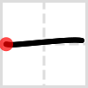    
2\. 丨 (ぼう) жезл, прут    
3\. 丶 (てん) точка    
4\. 丿 (てん) НО-кана    
5\. 乙 (おつ) рыбный крючок    
6\. 亅 (はねぼう) шип, колючка, ус  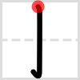  
##### 2 черты  

7\. 二(に) два     
8\. 亠 (なべぶた) крышка    
9\. 人 (ひと) человек  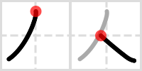  
10\. 儿 (にんにょう) ноги человека    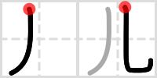  
11\. 入 (いる) входить    
12\. 八 (はちがしら) восемь    
13\. 冂 (まきがまえ) витрина, прилавок    
14\. 冖 (わかんむり) корона  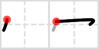  
15\. 冫 (にすい) капли воды  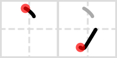  
16\. 几 (つくえ) стол    
17\. 凵 (うけばこ) открытая коробка  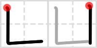  
18\. 刀 (かたな) меч    
19\. 力 (ちから) сила    
20\. 勹 (つつみがまえ) заворачивать, оборачивать    
21\. 匕 (さじのひ) ложка    
22\. 匚 (はこがまえ) коробка с открытой стенкой    
23\. 匸 (かくしがまえ) прятать  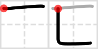  
24\. 十 (じゅう) крест  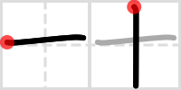  
25\. 卜 (ぼくのと) волшебная палочка    
26\. 卩 (ふしづくり) печать  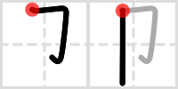  
27\. 厂 (がんだれ) утес    
28\. 厶 (む) я   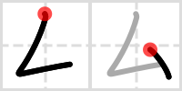  
29\. 又 (また) кроме того, при этом  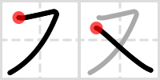  
##### 3 черты  

30\. 口(くち) рот      
31\. 囗 (くにがまえ) коробка    
32\. 土 (つち) земля, почва    
33\. 士 (さむらい) самурай  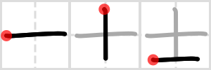  
34\. 夂 (ふゆがしら) зима, начинать  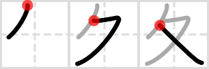  
35\. 夊 (すい) волочить ноги    
36\. 夕 (ゆうべ) вечер  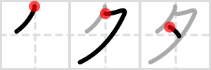  
37\. 大 (だい) большой    
38\. 女 (おんな )женщина  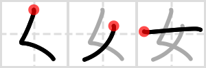  
39\. 子 (こ) ребенок    
40\. 宀 (うかんむり) корона  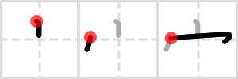  
41\. 寸 (すん) клей    
42\. 小 (ちいさい) маленький    
43\. 尢 (まげあし) изогнутый «большой»    
44\. 尸 (しかばね) флаг  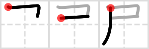  
45\. 屮 (てつ) старая трава  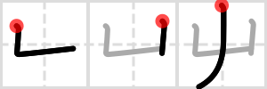  
46\. 山 (やま) гора    
47\. 川 (まがりがわ) изогнутая «река»    
48\. 工 (たくみ) навык, рабочий    
49\. 己 (おのれ) змея    
50\. 巾 (はば) одежда    
51\. 干 (はす) сухой    
52\. 幺 (いとがしら)короткая нитка    
53\. 广 (まだれ) утес с точкой    
54\. 廴 (いんにょう) широкий шаг  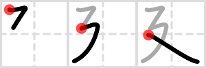  
55\. 廾 (にじゅうあし) двадцать    
56\. 弋 (しきがまえ) церемония    
57\. 弓 (ゆみ) лук (оружие)    
58\. ヨ (けいがしら) голова свиньи    
59\. 彡 (さんづくり) пучок    
60\. 彳 (ぎょうにんべん) идущий человек  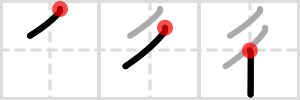  
##### 4 черты  

61\. 心(りっしんべん) сердце     
62\. 戈 (かのほこ) алебарда   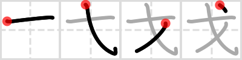  
63\. 戸 (とびらのと) дверь   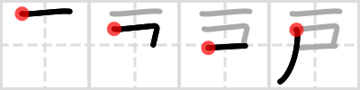  
64\. 手 (て) рука   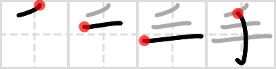  
65\. 支 (しんよう) ветка     
66\. 攴 (ぼくづくり) складной стул   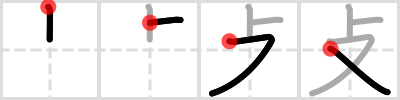  
67\. 文 (ぶんにょう) предложение, фраза   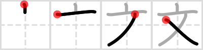  
68\. 斗 (とます) ковш, черпак     
69\. 斤 (おの) топор     
70\. 方 (ほう) сторона, направление     
71\. 无 (むにょう) изогнутый «рай»   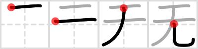  
72\. 日 (にち) солнце   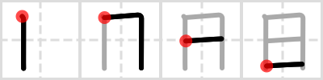  
73\. 曰 (にち) плоское солнце     
74\. 月 (つき) луна     
75\. 木 (き) дерево     
76\. 欠 (あくび) щель, пробел   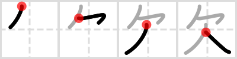  
77\. 止 (とめる) остановиться     
78\. 歹 (がつへん) смерть   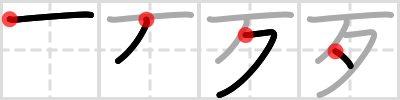  
79\. 殳 (ほこつくり) снова ветрено     
80\. 毋 (なかれ) мать     
81\. 比 (くらべるひ) состязание в беге   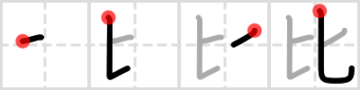  
82\. 毛 (け) шерсть     
83\. 氏 (うじ) клан     
84\. 气 (きがまえ) дух     
85\. 水 (みず) вода     
86\. 气 (ひ) огонь     
87\. 爪 (つめ) коготь     
88\. 父 (ちち) отец     
89\. 爻 (めめ) двойной X   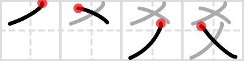  
90\. 爿 (しょうへん) левосторонний «трафарет»     
91\. 片 (かた) односторонний трафарет   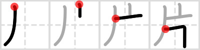  
92\. 牙 (きばへん) клык   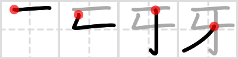  
93\. 牛 (うし) корова     
94\. 犬 (いぬ) собака     
96\. 王 (おう) король   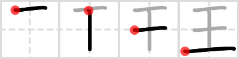  
##### 5 черт  

95\. 玄(げん) таинственный    
96\. 玉 (うし) драгоценность  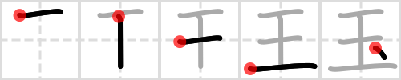  
97\. 瓜 (うり) арбуз  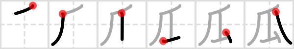  
98\. 瓦 (かわら) черепица    
99\. 甘 (あまい) сладкий  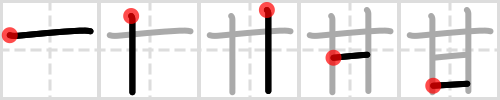  
100\.生 (うまれる) жизнь    
101\. 用 (もちいる) использовать  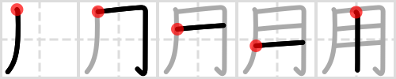  
102\. 田 (た) рисовое поле  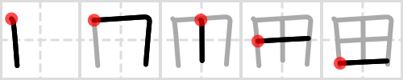  
103\. 疋 (ひき) численность    
104\. 疔 (やまいだれ) болезнь    
105\. 癶 (はつがしら) «шатер» с точками  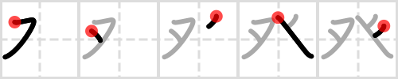  
106\. 白 (しろ) белый    
107\. 皮 (けがわ) прятаться    
108\. 皿 (さら) тарелка  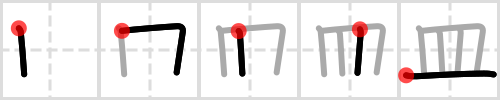  
109\. 目 (め) глаз    
110\. 矛 (むのほこ) алебарда    
111\. 矢 (や) стрела    
112\. 石 (いし) камень  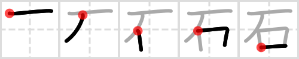  
113\. 示 (しめす) показывать, указывать    
114\. 禹 (うのあし) МУ в коробке    
115\. 禾 (のぎ) дерево с двумя ветками    
116\. 穴 (あな) щель, разрез    
117\. 立 (たつ) стоять  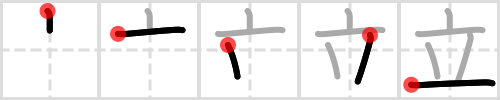  
##### 6 черт  

118\. 竹(たけ) бамбук    
119\. 米 (こめ) рис  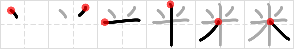  
120\. 糸 (いと) нитка  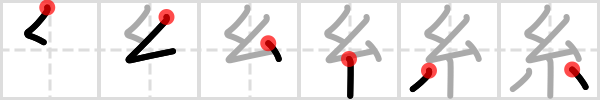  
121\. 缶 (ほとぎ) бидон, лейка    
122\. 网 (あみがしら) сеть  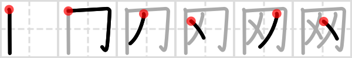  
123\. 羊 (ひつじ) овца  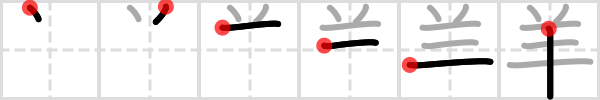  
124\. 羽 (はね) перья    
125\. 老 (おい) пожилой человек    
126\. 而 (しかして) грабли  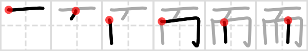  
127\. 耒 (らいすき) дерево с тремя ветками    
128\. 耳 (みみ ) ухо  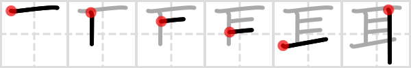  
129\. 聿 (ふでづくり) кисть для письма    
130\. 肉 (にく) мясо    
131\. 臣 (しん) вассал    
132\. 自 (みずから) себя    
133\. 至 (いたる) высшая точка, кульминация    
134\. 臼 (うす) мортира    
135\. 舌 (した) язык    
136\. 舛 (ます) танцевать    
137\. 舟 (ふね) корабль    
138\. 艮 (うしとら) хороший    
139\. 色 (いろ) цвет    
140\. 艸 (くさ) трава    
141\. 虍 (とらかんむり) тигр    
142\. 虫 (むし) насекомое    
143\. 血 (ち) кровь    
144\. 行 (ぎょう) идти    
145\. 衣 (ころも) одежда    
146\. 襾 (にし) запад    
##### 7 черт  

147\. 見(みる) видеть    
148\. 角 (つの) угол, рог    
149\. 言 (ことば) говорить    
150\. 谷 (たに) долина    
151\. 豆 (まめ) боб    
152\. 豕 (いのこ) свинья    
153\. 豸 (むじな) барсук    
154\. 貝 (かい) морская раковина    
155\. 赤 (あか) красный    
156\. 走 (はしる) бежать    
157\. 足 (あし) нога    
158\. 身 (み) тело    
159\. 車 (くるま) колесо    
160\. 辛 (からい) пряный    
161\. 辰 (しんのたつ) дракон    
162\. 辷 (しんにゅう) дорога    
163\. 邑 (むら) деревня    
164\. 酉 (ひよみのとり) сакэ    
165\. 釆 (のごめ) игральные кости    
166\. 里 (さと) деревня    
##### 8 черт  

167\. 金(かね) металл    
168\. 長 (ながい) длинный    
169\. 門 (もん) ворота    
170\. 阜 (ぎふのふ) деревня    
171\. 隶 (れいづくり) раб    
172\. 隹 (ふるとり) старая птица    
173\. 雨 (あめ) дождь    
174\. 青 (あう) зеленый, синий    
175\. 非 (あらず) несправедливость    
##### 9 черт  

176\. 面(めん) поверхность     
177\. 革 (かくのかわ) кожа     
178\. 韋 (なめしがわ) обожженная кожа     
179\. 韭 (にら) лук-порей     
180\. 音 (おと) звук     
181\. 頁 (おおがい) голова     
182\. 風 (かぜ) ветер     
183\. 飛 (とぶ) летать     
184\. 食 (しよく) еда     
185\. 首 (くび) шея     
186\. 香 (においこう) запах     
##### 10 черт  

187\. 馬(うま) лошадь    
188\. 骨 (ほね) кость    
189\. 高 (たかい) высокий    
190\. 髟 (かみがしら) длинные волосы    
191\. 鬥 (とうがまえ) сломанные ворота    
192\. 鬯 (ちよう) ароматные травы    
193\. 鬲 (かく) тренога    
194\. 鬼 (おに) демон    
##### 11 черт  

195\. 魚(うお) рыба    
196\. 鳥 (とり) птица    
197\. 鹵 (ろ) соль    
198\. 鹿 (しか) олень    
199\. 麥 (むぎ) пшеница    
200\. 麻 (あさ) лен    
##### 13 черт  

201\. 黄(きいろ) желтый    
202\. 黍 (きび) просо    
203\. 黒 (くろ) черный    
204\. 黹 (ふつ) шить    
205\. 黽 (べん) зеленая лягушка    
206\. 鼎 (かなえ) чайник на трех ножках    
207\. 鼓 (つづみ) барабанный бой    
208\. 鼠 (ねずみ) мышь    
##### 14 черт  

209\. 鼻(はな) нос    
210\. 齊 (せい) равный    
##### 15 черт  

211\. 齒(は )зуб    
##### 16 черт  

212\. 龍(りゅう) дракон  
213\. 龜 (かめ) черепаха    
##### 17 черт  

214\. 龠(やく) флейта    
  